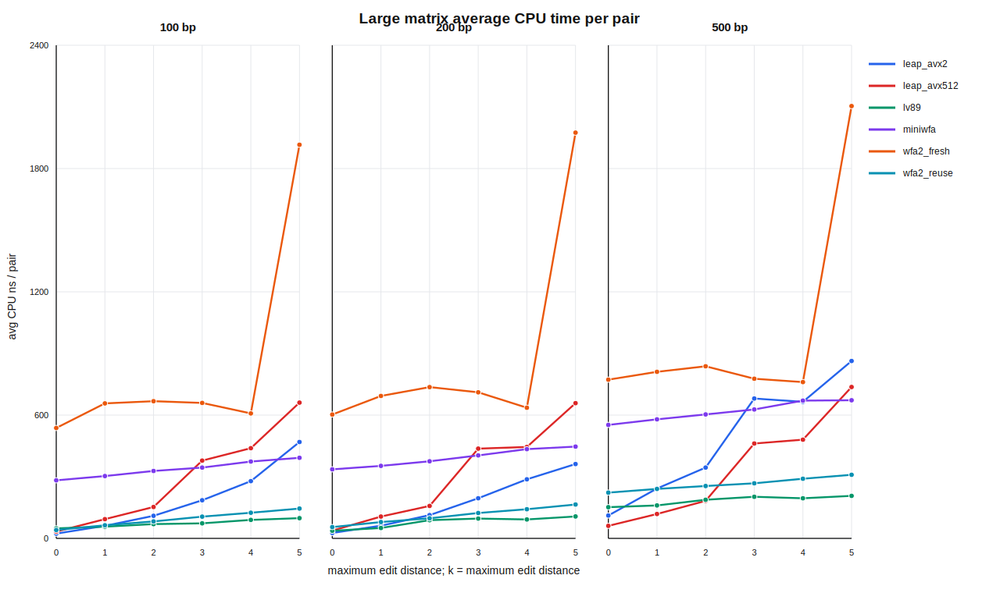

# Large Matrix Benchmark

- Generated at: 2026-05-20T22:54:48
- Lengths: 100, 200, 500 bp
- Maximum edit distances: 0, 1, 2, 3, 4, 5
- k: equal to maximum edit distance for each group
- Methods: leap_avx2, leap_avx512, lv89, miniwfa, wfa2_fresh, wfa2_reuse
- Cache mode: warm
- Target pairs per group: at least 1000000; actual count is rounded up to whole true_ed groups

LEAP timing note: `leap_avx2` and `leap_avx512` rows come from `mode=forward`; setup (`init_levenshtein`, `load_reads`, `calculate_masks`, `reset`) is outside the timed block, and the timed block wraps only `ed.run()`.

## Average CPU Time

Values are average CPU nanoseconds per pair.

| length_bp | max_edit_distance | k | pair_count | pairs_per_ed | leap_avx2 | leap_avx512 | lv89 | miniwfa | wfa2_fresh | wfa2_reuse |
| --- | --- | --- | --- | --- | --- | --- | --- | --- | --- | --- |
| 100 | 0 | 0 | 1000000 | 1000000 | 23.334 | 33.245 | 48.756 | 282.620 | 537.356 | 40.657 |
| 100 | 1 | 1 | 1000000 | 500000 | 61.062 | 93.600 | 56.998 | 303.352 | 656.985 | 63.805 |
| 100 | 2 | 2 | 1000002 | 333334 | 109.816 | 152.835 | 69.523 | 328.137 | 667.671 | 82.576 |
| 100 | 3 | 3 | 1000000 | 250000 | 185.564 | 378.556 | 73.240 | 344.621 | 659.291 | 105.817 |
| 100 | 4 | 4 | 1000000 | 200000 | 278.667 | 439.042 | 89.953 | 373.954 | 608.208 | 124.769 |
| 100 | 5 | 5 | 1000002 | 166667 | 469.019 | 660.720 | 98.518 | 392.221 | 1915.770 | 145.198 |
| 200 | 0 | 0 | 1000000 | 1000000 | 26.561 | 37.803 | 36.949 | 336.050 | 602.766 | 55.016 |
| 200 | 1 | 1 | 1000000 | 500000 | 61.701 | 106.262 | 50.608 | 352.876 | 693.214 | 79.507 |
| 200 | 2 | 2 | 1000002 | 333334 | 113.266 | 157.915 | 88.684 | 375.267 | 736.209 | 97.804 |
| 200 | 3 | 3 | 1000000 | 250000 | 195.288 | 436.783 | 96.471 | 403.851 | 710.943 | 123.555 |
| 200 | 4 | 4 | 1000000 | 200000 | 287.508 | 444.926 | 92.136 | 434.393 | 635.905 | 141.973 |
| 200 | 5 | 5 | 1000002 | 166667 | 361.828 | 658.185 | 106.733 | 446.649 | 1974.620 | 164.892 |
| 500 | 0 | 0 | 1000000 | 1000000 | 111.255 | 61.002 | 151.889 | 552.301 | 772.496 | 222.742 |
| 500 | 1 | 1 | 1000000 | 500000 | 242.632 | 118.660 | 160.402 | 579.410 | 810.637 | 240.732 |
| 500 | 2 | 2 | 1000002 | 333334 | 344.703 | 182.752 | 187.944 | 603.344 | 837.603 | 254.836 |
| 500 | 3 | 3 | 1000000 | 250000 | 680.691 | 461.723 | 202.465 | 627.469 | 776.989 | 268.053 |
| 500 | 4 | 4 | 1000000 | 200000 | 664.541 | 480.429 | 195.190 | 670.500 | 760.710 | 290.269 |
| 500 | 5 | 5 | 1000002 | 166667 | 863.316 | 736.722 | 206.898 | 672.259 | 2104.010 | 309.506 |

## Figure

